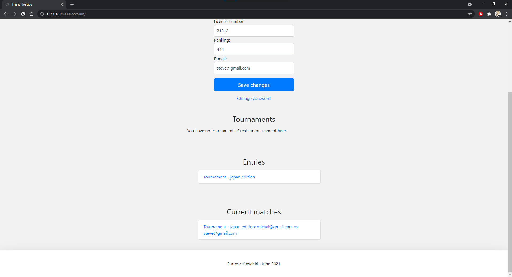

# chess-tournaments-website
The purpose of the application is to help users create chess tournaments. 

## Table of contents
* [General info](#general-info)
* [Technologies](#technologies)
* [Setup](#setup)
* [Screenshots](#screenshots)

## General info
This application uses Django framework to work. 

Functionalities:
- creating chess tournaments
- entering matches results
- showing tournament ranking list
- showing tournament location (google maps)
- e-mail confirmation system

The project was made in **June 2021**.

## Technologies
* Python 3.9
* Django 2.2.2
* django-easy-maps 1.1.2

All necessary libraries are in requirements.txt file.

## Setup
It`s preferred to open in PyCharm 

Clone this repository using git bash:
```
https://github.com/bartosztkowalski/chess-tournaments-website.git
```
Execute ```python manage.py runserver``` command to start the app (while being in /src folder).

## Screenshots




